# Hynox Campus Technical Architecture & Product Documentation Handbook
*Official Technical Specification and System Topology Manual*

---

## CHAPTER 1 — PLATFORM OVERVIEW

### 1.1 What is Hynox Campus?
**Hynox Campus** is an enterprise-grade multi-tenant educational portal designed to bridge physical classroom instruction with hands-on labs, automated assignment validation, and industry-aligned placement readiness. 

### 1.2 Vision & Business Goal
The primary objective of Hynox Campus is to raise student job-readiness by linking theoretical academic milestones to verifiable coding outputs ("proof-of-work"). From a business standpoint, Hynox Campus operates as a B2B SaaS platform that institutions (colleges, schools, vocational centers) purchase to manage, track, and accelerate their students' progress.

### 1.3 Multi-Tenant Architecture & Institution-Based Learning Model
Hynox Campus employs a strict multi-tenant isolation pattern using a Tenant ID. The system contains distinct schemas to segregate database domains, ensuring:
- **Data Privacy:** One institution cannot query or view another institution's data.
- **Content Reusability:** Master content templates can be safely duplicated into institution-specific courses.
- **Auditing & Governance:** Complete tracking of user and admin actions within each tenant.

### 1.4 Hierarchical Content Delivery Structure
The hierarchy follows a strict parent-child relationship cascading down from the Super Admin to the individual learning activities:

```mermaid
graph TD
    SuperAdmin["Super Admin (Platform Owner)"]
    ↓↓
    Institution["Institution (Tenant)"]
    ↓↓
    Programs["Programs (Degree Tracks)"]
    ↓↓
    Courses["Courses (e.g., Data Structures)"]
    ↓↓
    Modules["Modules (Chapters)"]
    ↓↓
    Lessons["Lessons (Lectures/Topics)"]
    ↓↓
    LearningActivities["Learning Activities (Quizzes, Projects, Challenges)"]

    style SuperAdmin fill:#0F172A,stroke:#2563EB,stroke-width:2px,color:#FFFFFF
    style Institution fill:#0F172A,stroke:#06B6D4,stroke-width:2px,color:#FFFFFF
    style Programs fill:#1E293B,stroke:#E2E8F0,stroke-width:1px,color:#FFFFFF
    style Courses fill:#1E293B,stroke:#E2E8F0,stroke-width:1px,color:#FFFFFF
    style Modules fill:#1E293B,stroke:#E2E8F0,stroke-width:1px,color:#FFFFFF
    style Lessons fill:#1E293B,stroke:#E2E8F0,stroke-width:1px,color:#FFFFFF
    style LearningActivities fill:#2563EB,stroke:#06B6D4,stroke-width:2px,color:#FFFFFF
```

---

## CHAPTER 2 — COMPLETE SYSTEM ARCHITECTURE

Hynox Campus is organized into six major functional domains to split responsibilities, secure multi-tenant boundaries, and scale learning workloads:

1. **Core:** Manages identity, RBAC (Role-Based Access Control), audit logging, and core profiles.
2. **Institution:** Models physical schools/colleges, administrative configurations, and status indicators.
3. **Library:** Operates as a master template library, holding decoupled reusable educational materials.
4. **Academic:** Stores the localized tenant-specific curriculum mapping programs, courses, modules, and lessons.
5. **Delivery:** Operates the live instruction plane, defining cohorts, student enrollments, course assignments, and lesson completion trackers.
6. **Learning:** Orchestrates hands-on evaluation workflows, containing activities (Quizzes, Projects, and Programming Challenges).

### 2.1 Domain-Level Architecture Flow

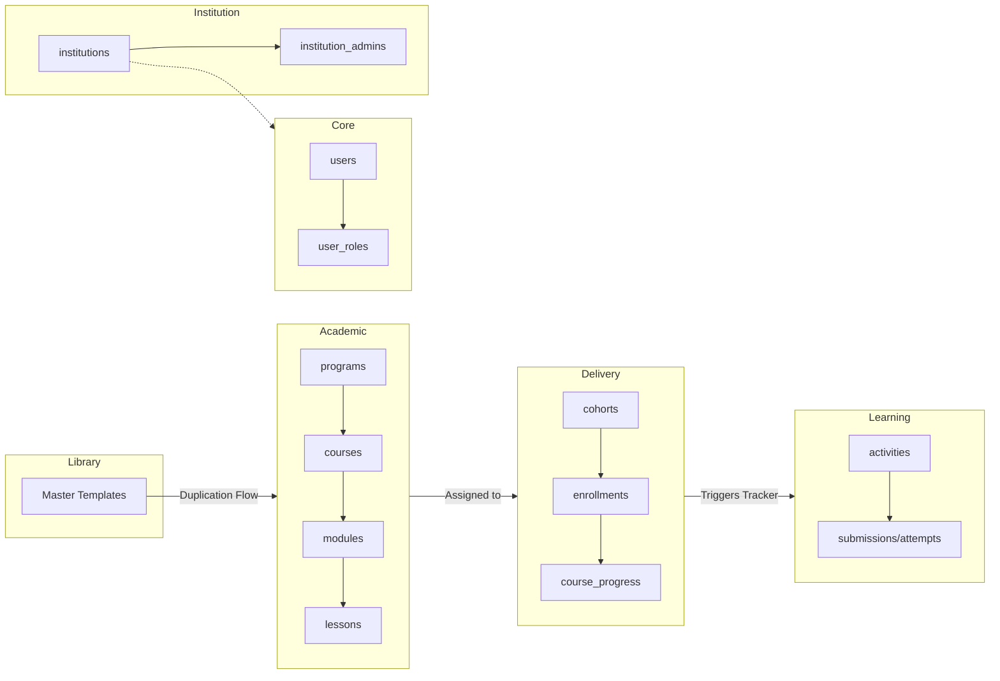

---

## CHAPTER 3 — CORE SCHEMA

The `core` schema handles security boundaries, authorization, audit tracks, and account onboarding.

### 3.1 Core Schema Table Definitions

#### `core.users`
* **Purpose:** Represents consolidated user profiles matching identity providers.
* **Columns:**
  - `id` (`UUID`, PK): Unique identifier.
  - `auth_user_id` (`UUID`, FK -> `auth.users.id`): References Supabase auth system.
  - `full_name` (`TEXT`): User's legal name.
  - `email` (`TEXT`, Unique): Primary registration email.
  - `tenant_id` (`UUID`, FK -> `institution.institutions.id`): Active tenant membership.
  - `status` (`TEXT`, FK -> `core.user_statuses.code`): E.g., `active`, `invited`.
  - `deleted_at` (`TIMESTAMPTZ`): Soft-delete indicator.

#### `core.roles`
* **Purpose:** Roles used to assign capabilities.
* **Seed Values:** `super_admin` (Priority 100), `institution_admin` (Priority 80), `trainer` (Priority 60), `student` (Priority 10), `public` (Priority 0).

#### `core.user_roles`
* **Purpose:** Junction table mapping users to roles.
* **Columns:** `user_id` (`UUID`, FK), `role_id` (`UUID`, FK).

#### `core.permissions`
* **Purpose:** Granular system permission strings (e.g., `course:create`, `submission:review`).

#### `core.role_permissions`
* **Purpose:** Mappings of permissions to roles.

#### `core.user_invitations`
* **Purpose:** Manages secure onboarding links generated for bulk-provisioned students.
* **Columns:** `id`, `user_id`, `token` (`UUID`), `expires_at`, `status` (`created`, `sent`, `accepted`, `expired`), `invitation_type`.

#### `core.audit_logs`
* **Purpose:** Immutable audit record of critical actions.
* **Columns:** `id`, `tenant_id`, `event_type` (e.g., `invitation_accepted`), `actor_user_id`, `metadata` (`JSONB`).

### 3.2 Core ER Diagram

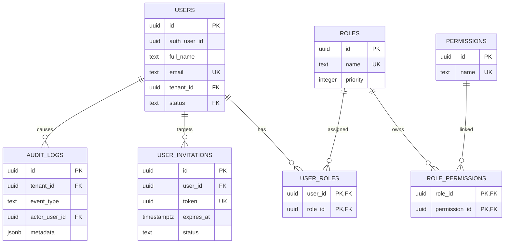

---

## CHAPTER 4 — INSTITUTION SCHEMA

The `institution` schema encapsulates tenant metadata, campus administrators, and operational state mappings.

### 4.1 Schema Tables
* **`institution.institutions`:** Stores the organization name, unique code (e.g., `VIT-CH`), subdomain slug, and address.
* **`institution.institution_admins`:** Mapping table associating institution administrators to specific institutions.
* **`institution.institution_types`:** Lookup table (e.g., `school`, `college`, `university`, `training_center`, `corporate_partner`).
* **`institution.institution_statuses`:** Lookup table (e.g., `active`, `inactive`, `suspended`, `onboarding`).

### 4.2 Institution Onboarding Workflow

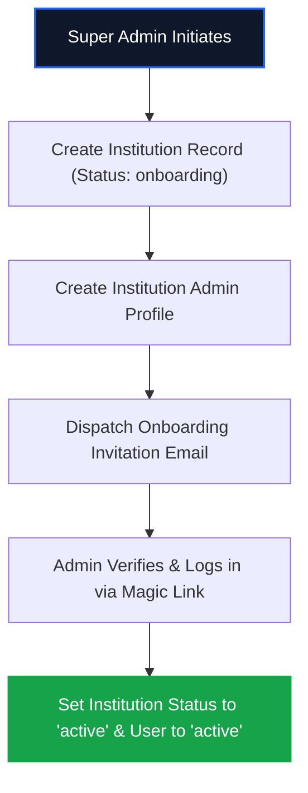

---

## CHAPTER 5 — LIBRARY SCHEMA

The `library` schema acts as a **Global Reusable Master Content Library**. Decoupled from any physical tenant, it holds master templates of courses and lessons curated by subject matter experts.

### 5.1 Tables
- **`library.course_templates`:** Blueprint for courses containing standard descriptions, learning objectives, and categories.
- **`library.module_templates`:** Blueprint for modules.
- **`library.lesson_templates`:** Blueprint for lessons (video placeholders, texts).
- **`library.resource_templates`:** Decoupled PDFs, cheatsheets, and files.
- **`library.template_categories` & `template_tags`:** Mappings for categorization.

### 5.2 Template Versioning
Every master template contains a `version` indicator (e.g., `v1.2.0`). When updates are made to a master template, the version increments. Localized copies inside `academic.courses` store the template ID and version they duplicated from to track drift.

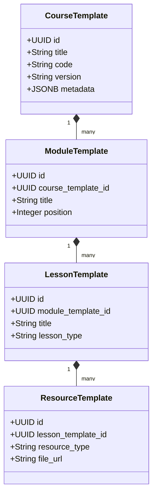

---

## CHAPTER 6 — LIBRARY → ACADEMIC DUPLICATION FLOW

When an institution purchases a course program, the library templates are cloned (deep-copied) into the `academic` schema. This creates localized copies that trainers can modify without affecting the master template.

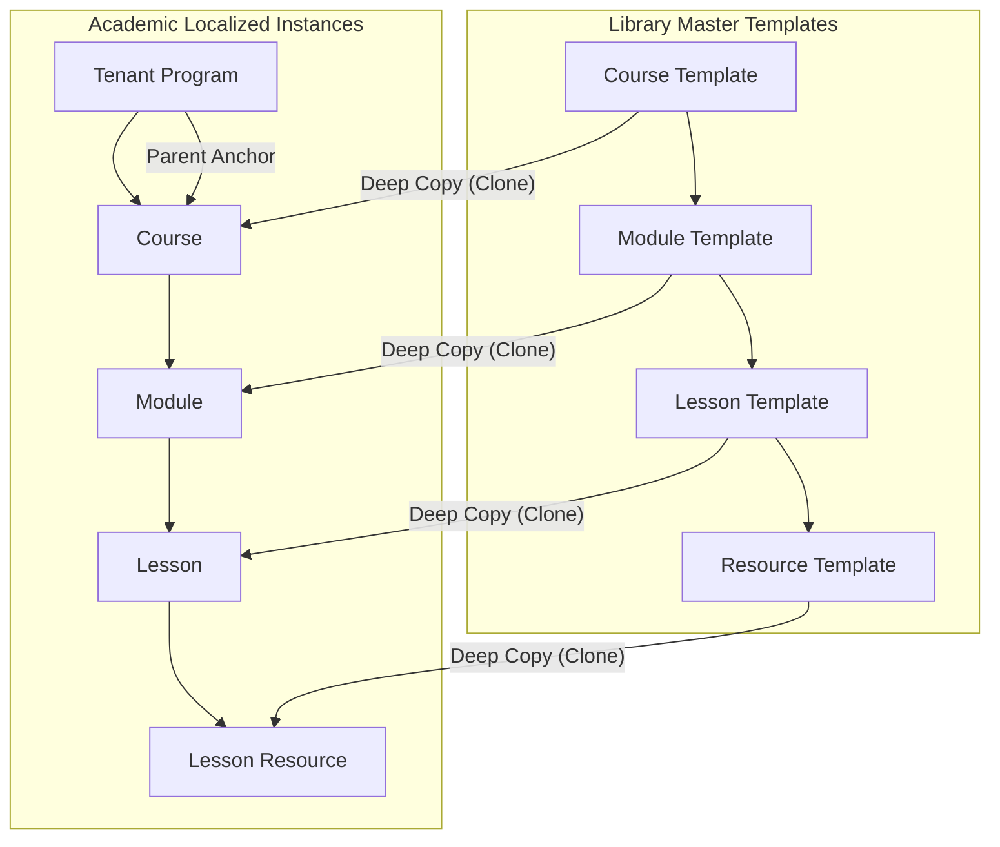

### Duplication Rules:
1. Relationships are preserved via matching foreign keys.
2. Tenant ID and Institution ID are written into all cloned tables.
3. Templates are assigned unique UUIDs on cloning to avoid collision.

---

## CHAPTER 7 — ACADEMIC SCHEMA

The `academic` schema contains the curriculum outline mapped to the institution's tenant scope.

### 7.1 Table Definitions
* **`academic.programs`:** High-level degree or track (e.g., "B.Tech Computer Science V1").
* **`academic.courses`:** A course associated with a program (e.g., "Full-Stack Web Development").
* **`academic.course_instructors`:** Junction mapping trainers to courses.
* **`academic.modules`:** Chapters within a course.
* **`academic.lessons`:** Lectures, labs, or assignments.
* **`academic.lesson_resources`:** Supporting materials like videos, slide PDFs, and markdown sheets.

### 7.2 Academic ERD

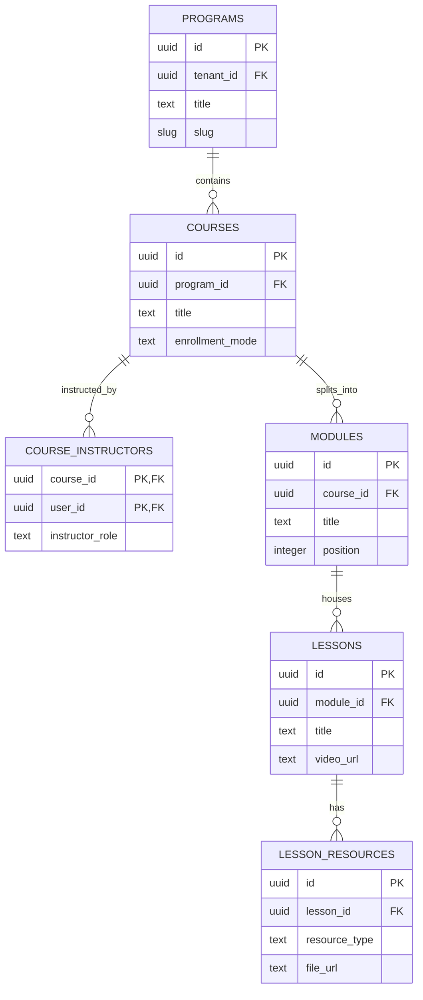

---

## CHAPTER 8 — DELIVERY SCHEMA

The `delivery` schema manages live deployment. It converts the academic curriculum outline into an active cohort-based delivery plane for students.

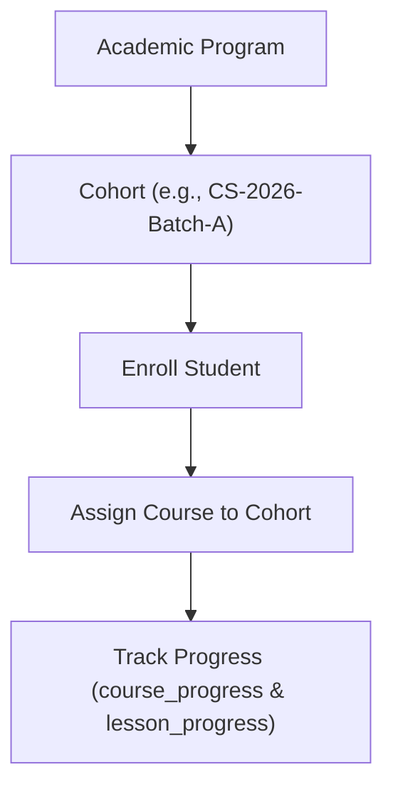

### 8.1 Schema Tables
- **`delivery.cohorts`:** Groups of students traversing a program at the same time.
- **`delivery.enrollments`:** Maps students to a cohort.
- **`delivery.course_assignments`:** Determines when a course goes live for a cohort.
- **`delivery.lesson_progress`:** Tracking table recording if a lesson is `not_started`, `in_progress`, or `completed`.
- **`delivery.course_progress`:** Aggregate progress tracker calculated from lesson completions.

---

## CHAPTER 9 — LEARNING SCHEMA

The `learning` schema orchestrates student evaluation actions. It decouples activities from the academic lessons structure to support multiple homework types.

### 9.1 Activity Hierarchy and Decoupling
An `activity` record represents a wrapper for an assessment. It contains a FK link to a lesson. The details of the activity reside in its specific sub-table based on the type:

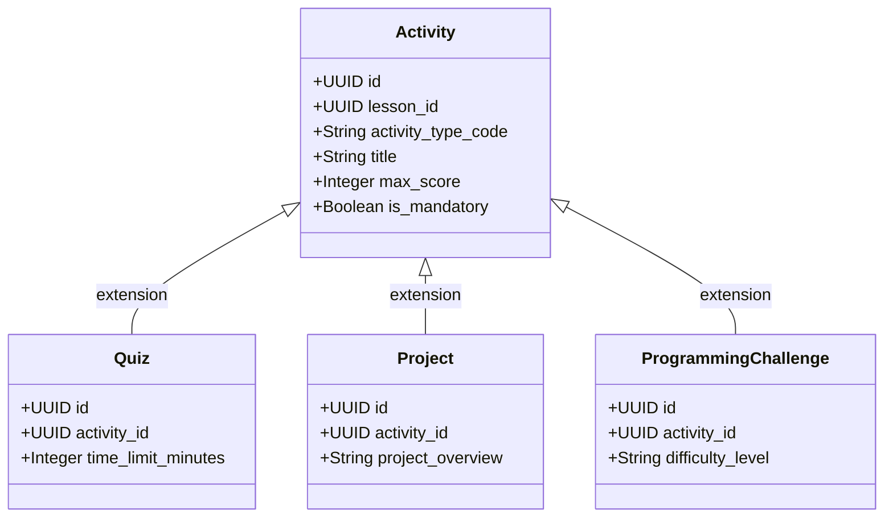

- **`learning.activities`:** Parent wrapper defining title, scoring limits, and schedules.
- **`learning.activity_assignments`:** Maps activities to cohorts.
- **`learning.student_activity_progress`:** Real-time state tracker (points scored, completion status).

---

## CHAPTER 10 — QUIZ SYSTEM

Quizzes provide instant automated knowledge validation.

### 10.1 Table Outlines
- **`learning.quizzes`:** Holds settings like time limits, shuffle settings, and maximum attempts.
- **`learning.quiz_questions`:** Questions linked to a quiz (types: `single_choice`, `multiple_choice`, `true_false`, `short_answer`).
- **`learning.quiz_options`:** Answer options for choice questions.
- **`learning.quiz_attempts`:** Records student submissions and scores.
- **`learning.quiz_answers`:** Selected answers submitted during an attempt.

### 10.2 Quiz Workflow

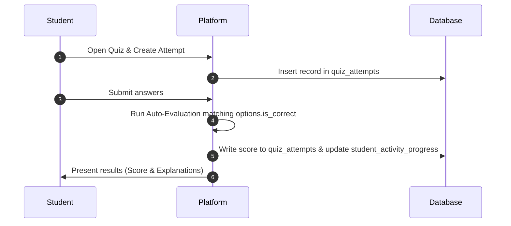

---

## CHAPTER 11 — PROJECT SYSTEM

Projects evaluate larger practical development assignments, utilizing peer, trainer, or Git check verification steps.

### 11.1 Tables
- **`learning.projects`:** Contains the requirements, deliverables, templates, and instructions.
- **`learning.project_submissions`:** Student's submission record (stores GitHub repo link, deployment live URL, and student notes).
- **`learning.project_reviews`:** Review records containing score, feedback text, and status (`pending`, `approved`, `rejected`, `revision_requested`).

### 11.2 Project Submission Workflow

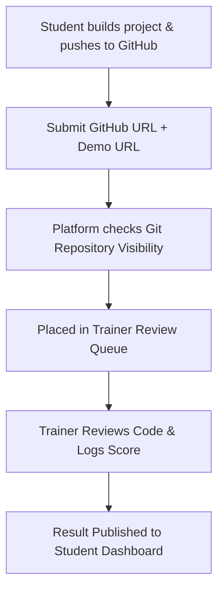

---

## CHAPTER 12 — PROGRAMMING CHALLENGE SYSTEM

This acts as a LeetCode-style evaluation engine, where code submitted by a student is executed against test cases in an isolated environment.

### 12.1 Tables
- **`learning.programming_challenges`:** Problem description, starter template code, and run limits (time/memory).
- **`learning.challenge_examples`:** Sample inputs and outputs shown to the student.
- **`learning.challenge_test_cases`:** Inputs and expected outputs (includes hidden test cases used for final grading).
- **`learning.challenge_submissions`:** Stores the submitted code, language (`javascript`, `python`, etc.), and status.
- **`learning.challenge_submission_results`:** Grading totals (test cases passed/failed, run time, and points scored).
- **`learning.challenge_test_case_results`:** Performance metrics on individual test cases.
- **`learning.challenge_execution_queue`:** Queue entry managing execution scheduling.
- **`learning.challenge_execution_logs`:** Compiling and runtime errors.

### 12.2 Challenge Evaluation Flow

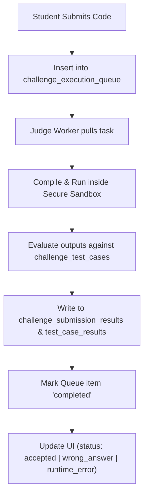

---

## CHAPTER 13 — JUDGE ENGINE ARCHITECTURE

The Judge Engine executes untrusted student code safely, asynchronously, and accurately.

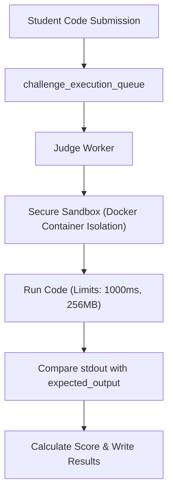

### 13.1 Key Architectural Components
1. **The Queue:** Uses `challenge_execution_queue` table rows as a message broker. Employs Postgres transactional locking (`SELECT ... FOR UPDATE SKIP LOCKED`) to coordinate multiple concurrent judge workers.
2. **The Sandbox:** Code executes inside isolated Docker containers. Network access is disabled to prevent database leaks or scraping.
3. **Execution Limits:** Execution terminates if it exceeds `time_limit_ms` (Time Limit Exceeded) or `memory_limit_mb` (Memory Limit Exceeded).
4. **Result Processing:** Results are compiled and updated in the database, triggering triggers that refresh the student's progress and career score metrics.

---

## CHAPTER 14 — DASHBOARD ARCHITECTURE

Hynox Campus implements isolated, focused workspaces customized to four user personas:

### 14.1 Persona Access Flows

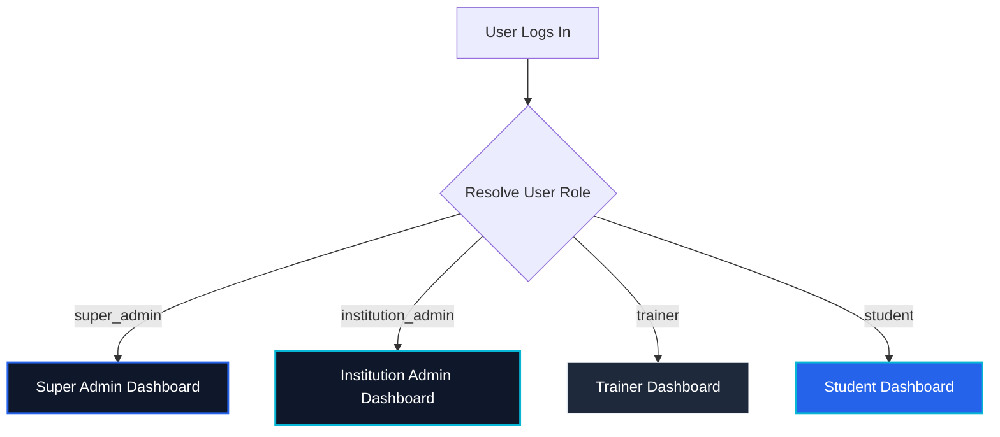

### 14.2 Dashboard Modules
- **Super Admin Dashboard:** Manage institutions, review system audit logs, and deploy global courses to the master Library.
- **Institution Admin Dashboard:** Provision trainers, create cohorts, import student spreadsheets, and track overall department placements.
- **Trainer Dashboard:** Review student github submissions, add learning activities (Quizzes/Projects), and view student progress.
- **Student Dashboard:** Course roadmaps, code playground, resume builder, placement prep utilities, and public portfolio.

---

## CHAPTER 15 — STUDENT JOURNEY

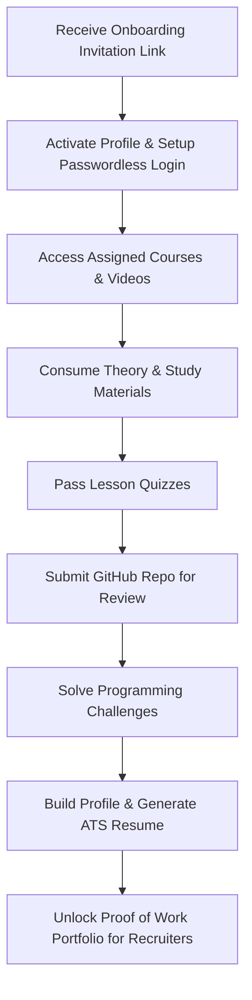

---

## CHAPTER 16 — TRAINER JOURNEY

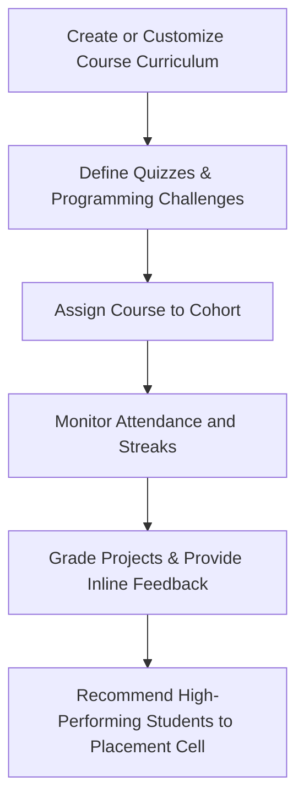

---

## CHAPTER 17 — ADMIN JOURNEY

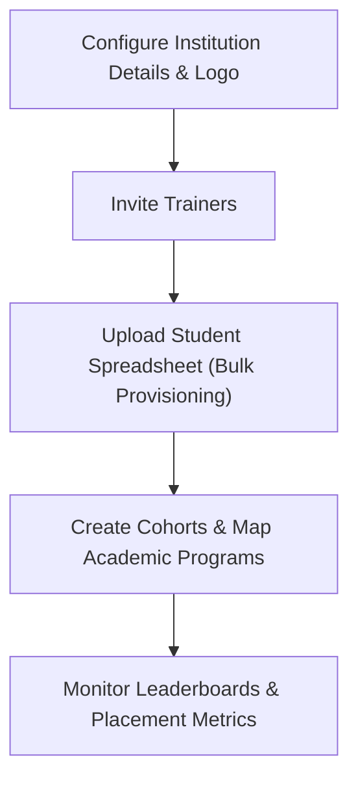

---

## CHAPTER 18 — ROLE-BASED ACCESS MATRIX

Access is controlled via permissions mapped to user roles in `core.role_permissions`.

| Permission / Functionality | Super Admin | Institution Admin | Trainer / Teacher | Student |
| :--- | :---: | :---: | :---: | :---: |
| **Manage Institutions** | ✅ | ❌ | ❌ | ❌ |
| **System-wide Audit Logs** | ✅ | ❌ | ❌ | ❌ |
| **Publish Master Templates** | ✅ | ❌ | ❌ | ❌ |
| **Provision Users & Trainers** | ✅ | ✅ | ❌ | ❌ |
| **Configure Cohorts** | ✅ | ✅ | ❌ | ❌ |
| **Edit Localized Courses** | ✅ | ✅ | ✅ | ❌ |
| **Grade Submissions** | ❌ | ❌ | ✅ | ❌ |
| **Attempt Quizzes & Labs** | ❌ | ❌ | ❌ | ✅ |
| **Build Resumes** | ❌ | ❌ | ❌ | ✅ |

---

## CHAPTER 19 — DATABASE RELATIONSHIP DIAGRAMS

The relationships between schemas are mapped below to show how foreign key constraints maintain data integrity:

### 19.1 Core & Institution Relationships
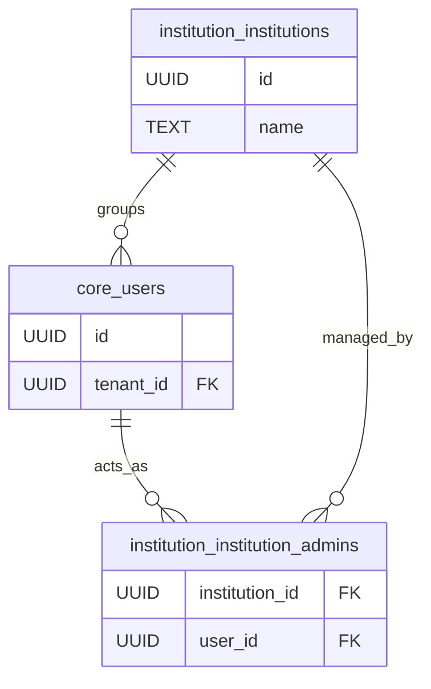

### 19.2 Academic, Delivery & Learning Connectors
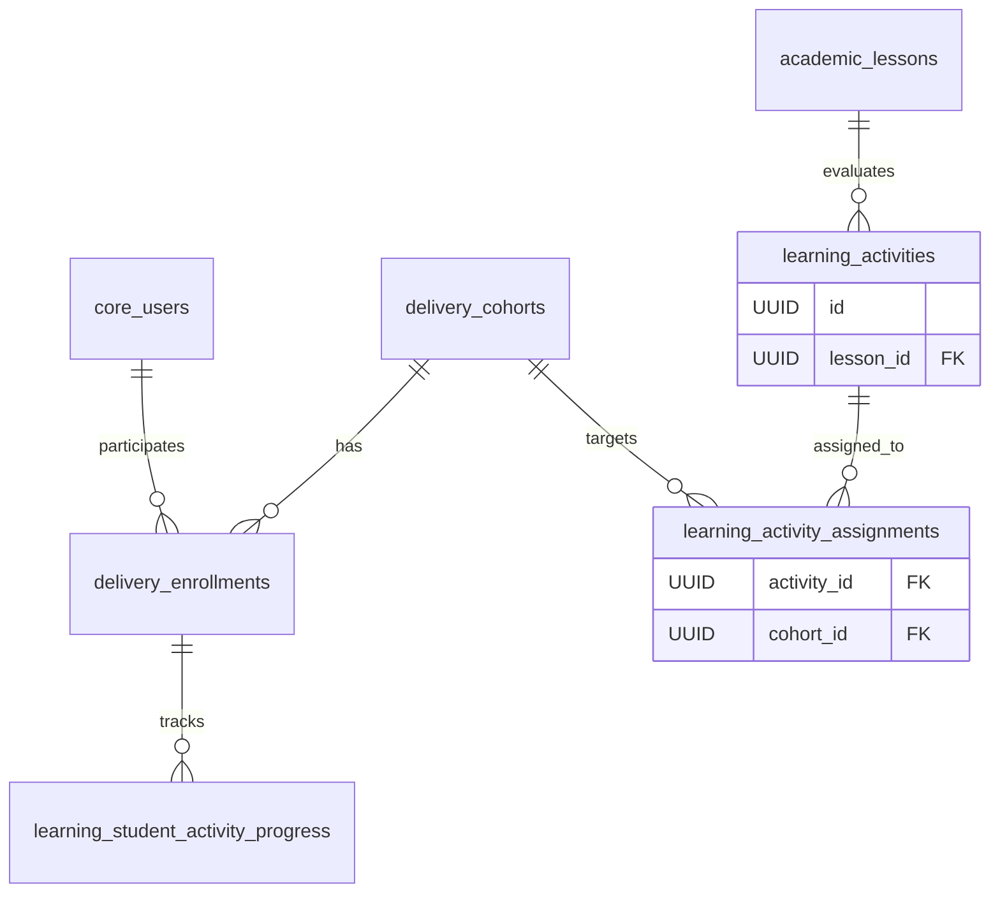

---

## CHAPTER 20 — COMPLETE DATA FLOW

The diagram below details how data flows end-to-end through the platform—from initial tenant onboarding to master content duplication, active student completion, and placement dispatch:

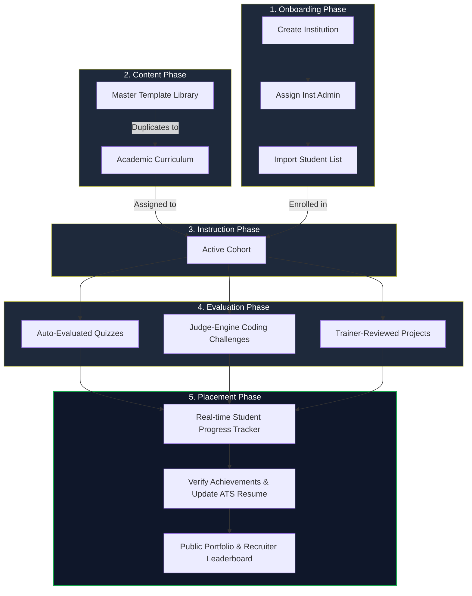
