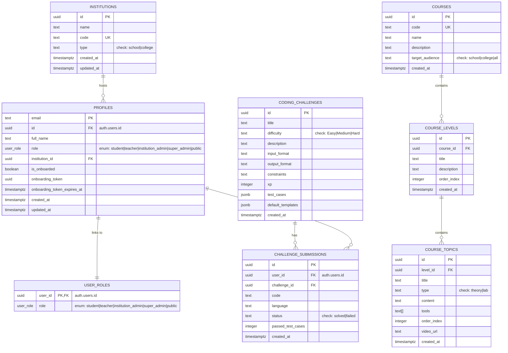

# Hynox Campus V1: Tech Stack & Feature Specification Document

This document outlines the software architecture, production-grade database schema, codebase structures, and core features for **Hynox Campus V1**. Hynox Campus is an educational portal engineered to bridge physical classroom instruction with digital hands-on labs, automated assignment validation, and industry-grade resume placements.

---

## 1. Core Tech Stack & Architecture

Hynox Campus V1 utilizes a modern, robust, and performant tech stack structured to allow modular expansion and ensure enterprise-level security.

### Core Framework & Language
* **Framework**: [Next.js 16.2.6](https://nextjs.org) (App Router, Server Actions for mutations, React 19).
* **Language**: [TypeScript](https://www.typescriptlang.org) (strict type-safety across front-end and back-end models).
* **Runtime**: Node.js environment.

### Design System & Aesthetics
* **CSS Framework**: [Tailwind CSS v4](https://tailwindcss.com) utilizing `@tailwindcss/postcss`.
* **Icons**: [Lucide React](https://lucide.dev) for lightweight vector iconography.
* **Micro-Animations**: [Framer Motion](https://www.framer.com/motion/) for fluid transitions, glowing hover feedback, and visual completion trackers.
* **Theme & UI**: Curated cyber-punk dark mode featuring glassmorphism, glowing borders (`cyan-500/20`), vibrant color hierarchies, and highly responsive page layouts.

### Backend, Auth & Storage
* **Database & BaaS**: [Supabase](https://supabase.com) (`@supabase/supabase-js` and `@supabase/ssr`).
* **Authentication**: Passwordless email magic links using Supabase Auth, integrated with a secure SMTP service.
* **Email System**: [Nodemailer](https://nodemailer.com) with custom HTML templates for onboarding/verification emails.
* **Spreadsheet Parser**: [SheetJS (xlsx)](https://sheetjs.com) for processing CSV and Excel files during bulk student provisioning.

---

## 2. Database Schema & Data Models

The database is built on PostgreSQL inside Supabase, featuring Row Level Security (RLS) on all public tables and automated synchronization of user profiles via database triggers.

### Relational Entity-Relationship Diagram



### Table Definitions & Constraints

#### 1. `public.institutions`
Stores institutional data representing contracted schools and colleges.
* `id` (`uuid`, PK, Default: `gen_random_uuid()`): Unique identifier.
* `name` (`text`): Academic name of the institution.
* `code` (`text`, Unique): Short identifier code (e.g. `SKASC`).
* `type` (`text`, Default: `'college'`): Check constraint `type = ANY (ARRAY['school'::text, 'college'::text])`.
* `created_at`/`updated_at` (`timestamptz`): Audit timestamps.

#### 2. `public.profiles`
User profiles matching the authentication users table. Includes onboarding invite tokens.
* `email` (`text`, PK): Registered email (enforces uniqueness).
* `id` (`uuid`, FK -> `auth.users.id`, Nullable): Linked once user signs in.
* `full_name` (`text`): User's legal name.
* `role` (`user_role`): Custom postgres enum `('student', 'teacher', 'institution_admin', 'super_admin', 'public')`.
* `institution_id` (`uuid`, FK -> `public.institutions.id`, Nullable): Affiliated school/college.
* `is_onboarded` (`boolean`, Default: `false`): Onboarding flag.
* `onboarding_token` (`uuid`): Temporary secure token generated for bulk invitations.
* `onboarding_token_expires_at` (`timestamptz`): Standard 7-day expiration time.
* `created_at`/`updated_at` (`timestamptz`): Audit timestamps.

#### 3. `public.user_roles`
Lookup table mapping authorized roles to primary authentication records.
* `user_id` (`uuid`, PK, FK -> `auth.users.id`): Linked auth record.
* `role` (`user_role`, Default: `'public'`): Authorized role.

#### 4. `public.courses`
Curriculum outlines mapped to academic tracks.
* `id` (`uuid`, PK, Default: `gen_random_uuid()`): Unique identifier.
* `code` (`text`, Unique): Unique catalog course code (e.g. `FSD-COLLEGE`).
* `name` (`text`): Full name of the course.
* `description` (`text`, Nullable): Brief synopsis.
* `target_audience` (`text`): Check constraint `target_audience = ANY (ARRAY['school'::text, 'college'::text, 'all'::text])`.
* `created_at` (`timestamptz`): Time of creation.

#### 5. `public.course_levels`
Chapters/modules within a single course catalog item.
* `id` (`uuid`, PK, Default: `gen_random_uuid()`): Unique identifier.
* `course_id` (`uuid`, FK -> `public.courses.id`): Parent course identifier.
* `title` (`text`): Level title (e.g. "Level 1: Git Basics").
* `description` (`text`, Nullable): Scope of the module.
* `order_index` (`integer`, Default: `0`): Sequential ordering priority.
* `created_at` (`timestamptz`): Time of creation.

#### 6. `public.course_topics`
Individual lectures, videos, theory articles, or labs within a level.
* `id` (`uuid`, PK, Default: `gen_random_uuid()`): Unique identifier.
* `level_id` (`uuid`, FK -> `public.course_levels.id`): Parent level.
* `title` (`text`): Topic name.
* `type` (`text`): Check constraint `type = ANY (ARRAY['theory'::text, 'lab'::text])`.
* `content` (`text`, Nullable): Study notes or reference content.
* `tools` (`text[]`, Default: `'{}'`): List of frameworks/languages referenced (e.g. `['React', 'Next.js']`).
* `order_index` (`integer`, Default: `0`): Topic sequence.
* `video_url` (`text`, Nullable): Link to the recorded video class.
* `created_at` (`timestamptz`): Time of creation.

#### 7. `public.coding_challenges`
Coding tasks loaded for daily exercises or assignments.
* `id` (`uuid`, PK, Default: `gen_random_uuid()`): Unique identifier.
* `title` (`text`): Challenge title.
* `difficulty` (`text`): Check constraint `difficulty = ANY (ARRAY['Easy'::text, 'Medium'::text, 'Hard'::text])`.
* `description` (`text`): Detailed instructions.
* `input_format` / `output_format` / `constraints` (`text`, Nullable): Exercise constraints.
* `xp` (`integer`, Default: `100`): Points rewarded on successful submission.
* `test_cases` (`jsonb`): Array of inputs and expected outputs.
* `default_templates` (`jsonb`): Code skeletons for various languages.
* `created_at` (`timestamptz`): Time of creation.

#### 8. `public.challenge_submissions`
Records coding submissions made by students.
* `id` (`uuid`, PK, Default: `gen_random_uuid()`): Unique identifier.
* `user_id` (`uuid`, FK -> `auth.users.id`): Submitter identifier.
* `challenge_id` (`uuid`, FK -> `public.coding_challenges.id`): Related exercise.
* `code` (`text`): Submitted script code.
* `language` (`text`): Programming language runtime.
* `status` (`text`): Check constraint `status = ANY (ARRAY['solved'::text, 'failed'::text])`.
* `passed_test_cases` (`integer`, Default: `0`): Test success counts.
* `created_at` (`timestamptz`): Submission timestamp.

---

## 3. Codebase File Structure & Routing

The Next.js folder structure mirrors the role-based design and contains isolated workspaces for students, teachers, institutions, and platform administrators.

```
src/
├── app/
│   ├── auth/                      # Authentication callbacks
│   ├── login/                     # Secure sign-in (Magic Links)
│   ├── onboarding/                # Token-based account claim wizard
│   ├── dashboard/                 # Role-Based Hubs
│   │   ├── admin/                 # Super Admin controls (bulk enrollment)
│   │   ├── institution/           # Principal & HOD leaderboard
│   │   ├── teacher/               # Student homework/code review panel
│   │   ├── student/               # Student Interactive Console
│   │   │   ├── courses/           # Curriculum & Video Roadmap
│   │   │   ├── video-learning/    # Recorded Session Library
│   │   │   ├── study-materials/   # PDFs, Cheatsheets, Docs
│   │   │   ├── programming/       # daily coding challenges & playground
│   │   │   ├── projects/          # Final project briefings & Git checks
│   │   │   ├── quizzes/           # Assessment module
│   │   │   ├── ai-assistant/      # AI Career Copilot
│   │   │   ├── resume-scanner/    # ATS alignment analyzer
│   │   │   ├── job-guidance/      # Placement prep
│   │   │   ├── settings/          # Profile config
│   │   │   └── page.tsx           # Student home dashboard
│   │   └── page.tsx               # Session resolver and router
│   ├── layout.tsx                 # Core styling wrapper
│   └── globals.css                # Base styling tokens (Tailwind)
├── lib/
│   ├── admin-actions.ts           # Server Actions for admin (onboarding, spreadsheet ingest)
│   ├── auth-utils.ts              # Session resolution & role routing
│   ├── course-actions.ts          # Server Actions for curriculum creation & loading
│   ├── email-service.ts           # Nodemailer HTML template and SMTP client
│   ├── supabase.ts                # Client-side Supabase client
│   └── supabase-server.ts         # Server-side Supabase client (cookie-based)
```

---

## 4. Detailed Feature Specifications (V1 Scope)

### Pillar 1: Enterprise Login & Onboarding
* **High-Level Flow**:
  1. **Contract & Data Ingest**: Institution registers -> Admin gets student details (CSV/Excel).
  2. **Bulk Provisioning**: Super Admin uploads files via a drag-and-drop parser (`xlsx` library in `src/lib/admin-actions.ts`).
  3. **Onboarding Tokens**: Profiles are generated with secure UUID tokens valid for 7 days.
  4. **Email Dispatch**: Nodemailer sends custom dark-mode invitation templates containing activation links.
  5. **Magic Link Activation**: Clicking the link routes students to `/onboarding/verify`, logs them in passwordlessly, assigns their specific domain catalog, and opens the 3-step initialization wizard to finalize details.
  
### Pillar 2: The Learning Bridge
* **Curriculum Roadmap**: A visual roadmap indicating completed daily topics vs. upcoming sessions.
* **Recorded Session Library**: Access to physical classroom class recordings.
* **Digital Study Materials**: Access to PDFs, cheatsheets, and lecture documentation.
* **Attendance Streaks**: A manual check-in button (restricted to physical class hours and geo-fencing/wifi IP validation for college cohorts) to log and maintain attendance streaks.

### Pillar 3: Practical Lab & Submissions
* **Daily Guided Coding Challenges**: Small exercises mapped to lessons. Features an **Integrated Code Playground** for HTML/CSS/JS or Python so students can test ideas in the browser without local installs.
* **Problem Statements**: Instructions accompanied by helpful hints that unlock on a time delay.
* **GitHub Integration & Verification**: Input field to link a public GitHub repository. The backend runs a validation check ("pings" the API) to confirm the repository is public and readable.
* **Instructor Evaluation Flow**: Teachers receive submissions and toggle between `Pending Review`, `Changes Requested` (attaching feedback snippets to code blocks), or `Verified` ✅.
* **Live Demo URL Integration**: Field for inserting deployment links (Vercel, Firebase, Netlify) to show off working builds.

### Pillar 4: Real-time Gamification & Badges
* **Completion Tracker**: Responsive percentage bar displaying progress across classes and project submissions.
* **Resume Strength Meter**: A dashboard utility calculating completeness of their developer profile (requires verified projects, linked GitHub, and filled bio).
* **Badges & Consistency Awards**:
  - *Skill Badges*: E.g., "React Rookie", "Git Pro", "SQL Master".
  - *Consistency Badges*: E.g., Logging in 7 consecutive days, completing tasks within 24 hours of lecture.
  - *Public Showcase*: Unlocked badges automatically anchor to the student's public web profile.

### Pillar 5: Auto-Resume Builder & Placements
* **Dynamic Ingestion**: Ingests student metadata, Git repositories, verified projects, and earned badges automatically into standard formats.
* **AI Bullet Point Polisher**: Server-side LLM calls format raw descriptions (e.g. "I built this website") into action-oriented professional bullet points (e.g., "Engineered responsive full-stack platform integrated with Supabase RLS and Next.js Server Actions").
* **Templates**: 2-3 ATS-compliant templates designed to pass company screening.
* **One-Click PDF Export**: Downloadable resumes containing a custom **Hynox Verification Stamp QR code** redirecting recruiters to the student's interactive portfolio.

### Pillar 6: Premium Standout Features
* **AI Career Copilot (Interviewer)**: Once a student submits a verified project, an AI agent reviews their code and triggers a 3-question chat-based interview, prompting them to explain architectural choices. Performance compiles into a "Communication Score" added to their profile.
* **"Proof of Work" Public Portfolio**: A unique public URL (e.g. `campus.hynox.in/student-name`) displaying verified projects, recorded video demos, and the Hynox verification stamp.
* **Institutional Placement Leaderboard**: B2B admin dashboard for HODs and Placement Cells to instantly identify job-ready candidates with high resume strength and track progress across departments.
